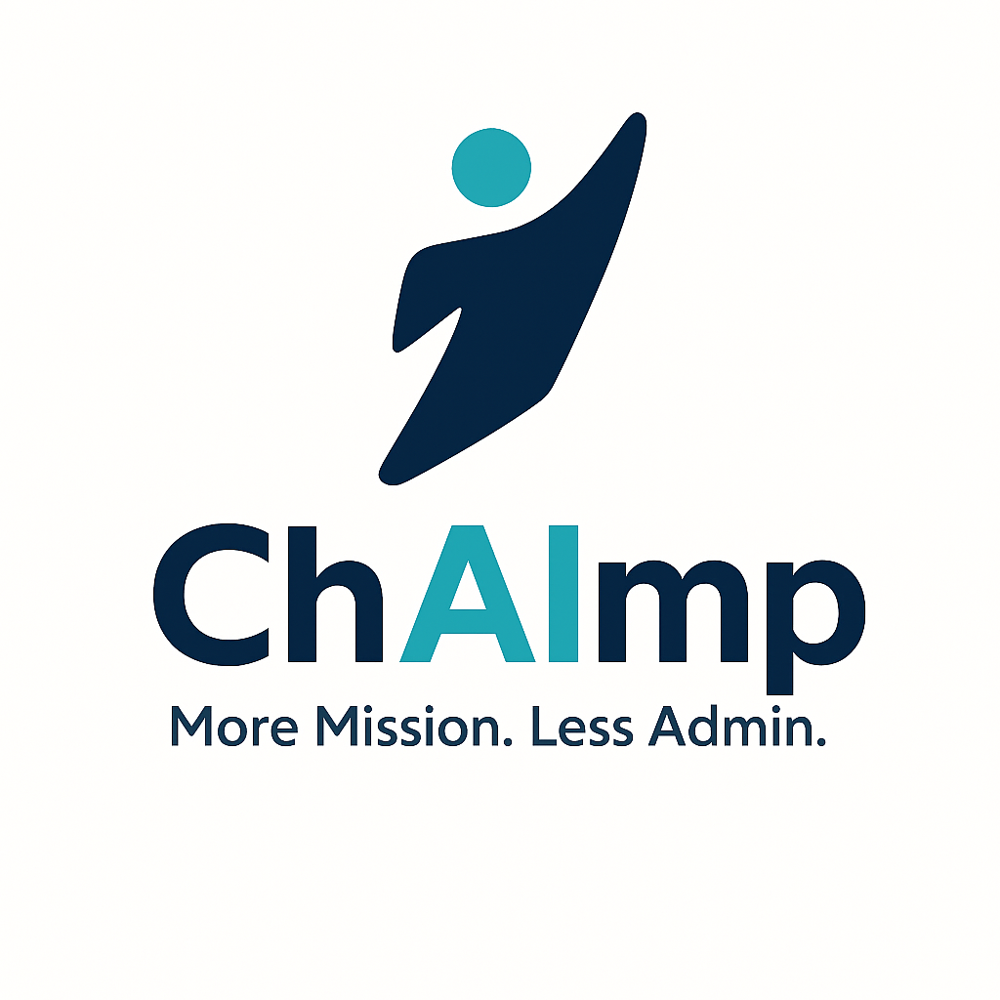

# ChAImp

  

> **ChAImp — Championing Nonprofits through AI and Mission Progression | More Mission. Less Admin.**

ChAImp helps small and medium 501(c)(3) nonprofit organizations unlock the power of modern technology — so they can spend more time on their mission and less time on administrative burden.

ChAImp is currently working with two 501(c)(3) organizations across the Pacific Northwest, delivering governed AI and digital transformation solutions that free their teams to focus on what matters most.

## What We Do

We partner with nonprofits to design and implement practical, governed technology solutions across:

- **AI Integration** — purpose-built AI tools and workflows tailored to nonprofit operations
- **RAG Architecture** — retrieval-augmented generation systems for knowledge management, grant research, and constituent services
- **Digital Transformation** — modernizing legacy processes and tools to reduce friction and manual work
- **Infrastructure Modernization** — cloud-first architecture that is secure, scalable, and cost-efficient
- **Governed Technology Solutions** — responsible AI and data governance frameworks appropriate for mission-driven organizations

## Built With

- [Claude](https://www.anthropic.com) — AI reasoning and language capabilities
- [GitHub Copilot](https://github.com/features/copilot) — developer productivity
- [React](https://react.dev) — modern user interfaces
- [Vercel](https://vercel.com) — fast, reliable deployment infrastructure

## About the Founder

**James Whelan** is a 25+ year Microsoft veteran based in Woodinville, Washington. He founded ChAImp to bring enterprise-grade technology thinking to the nonprofit sector — organizations that often have the greatest need and the fewest resources to meet it.

Connect with James on [LinkedIn](https://linkedin.com/in/jwhelanmsft)

## Get Involved

If you lead or support a nonprofit and want to explore what AI and modern technology could do for your organization, we'd love to hear from you.

- **Website:** [chaimp.org](https://chaimp.org)
- **GitHub:** [github.com/ChAImpNP](https://github.com/ChAImpNP)
- **LinkedIn:** [ChAImp on LinkedIn](https://linkedin.com/company/chaimp)

---

*ChAImp is committed to responsible, transparent, and human-centered technology adoption for the social sector.*
<!-- AB#318 anti-deadlock probe - closed unmerged, never lands -->
